# Get started with this GitHub project

Follow these steps to check out the project from GitHub.

* Open Terminal in Code:
  * 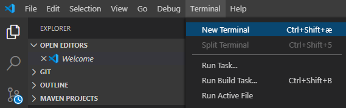
* Run the git clone command:
  * git clone https://github.com/RobotsAndFlames/Python-ArcadeAcademy.git
  * 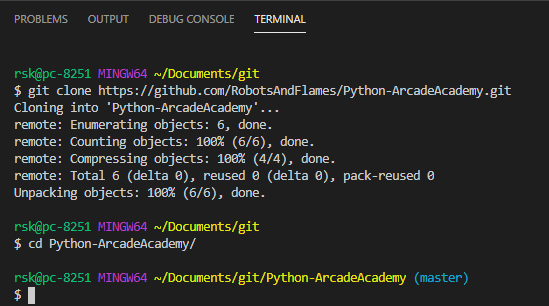
* Open the newly created folder in Code:
  * 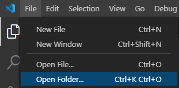
  * 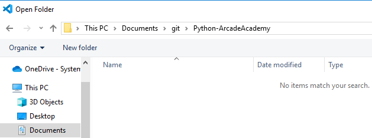
* Now you have the project and it is linked to the GitHub project:
  * 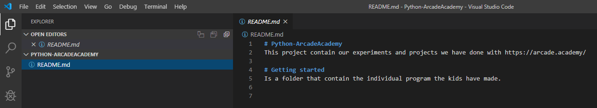

# Contribute to the GitHub project

Follow these steps to add/change something to the project.

* Make your own folders in 02_Python_introduction, like this one called Robert
* Place your Python code in here.
  * 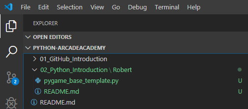
* Select the Source Control part of Code
  * 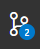
* Allways first Pull from GitHub, to see if others made changes
  * 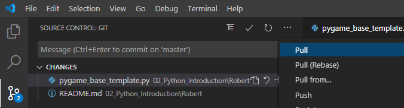
  * Then you have to merge if there are conflicts in the changes you made
* Select the files to stage and commit (local on your machine)
  * 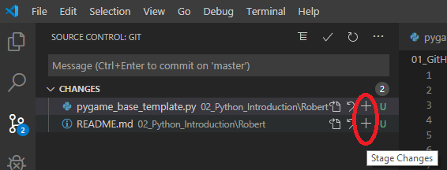
* Write a commit message (which changes did you make?) and commit with the checkmark
  * 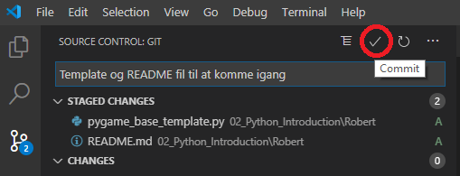
* Push your changes to GitHub
  * 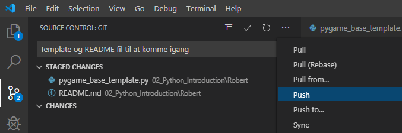
  * Require Login the first time
  * 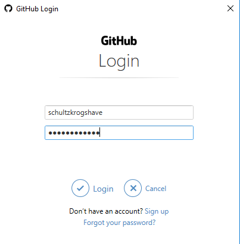
* Now you will be able to see your changes on github
  * https://github.com/RobotsAndFlames/Python-ArcadeAcademy/commits/master
  * 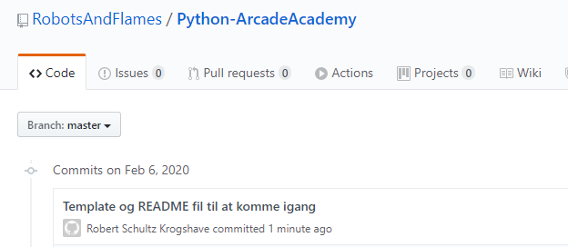